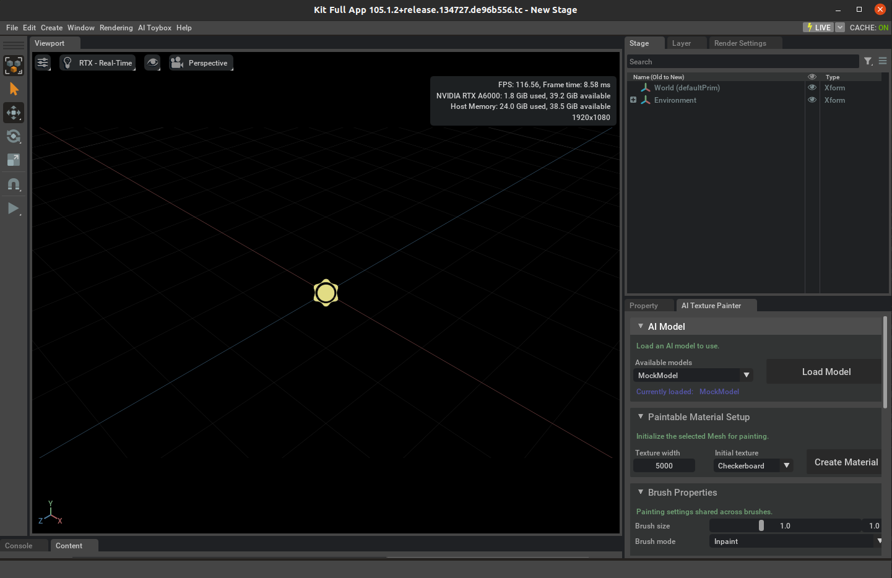
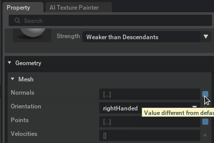
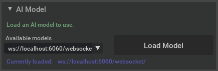
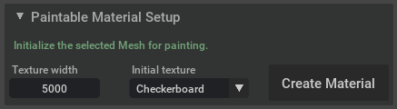
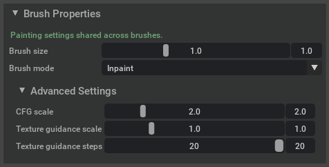
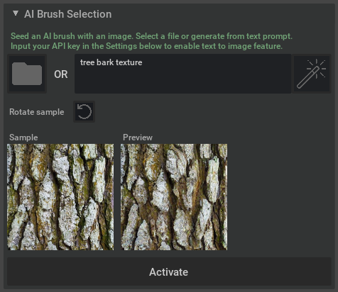
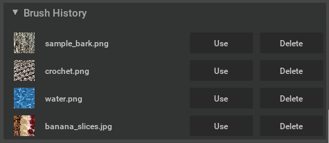

# Diffusion Texture Painting in Omniverse

The Omniverse Kit Extension in `source/extensions/aitoybox.texture_painter`
provides the UI for texture painting and communicates with the TRT inference server to generate brush strokes.

Based on the Omniverse Kit App Template: https://github.com/NVIDIA-Omniverse/kit-app-template/tree/105.1

## Tutorial

This kit application runs the full Omniverse Kit app with our texture painter extension enabled.
If this is your first time using Omniverse, you can refer to [Getting Started in NVIDIA Omniverse Youtube Playlist](https://www.youtube.com/playlist?list=PL4w6jm6S2lztLazLC7P0I4SnX3gxdL1Ad).

After launching the kit application, you will see the "AI Texture Painter" extension window on the bottom right.
Here are instructions for preparing the asset and a detailed breakdown of the extension UI to get you started!

### 0. Preprocessing Assets

In order to make a 3D model suitable for painting, generating a good UV layout is most crucial.
- Create UV layout with non-overlapping UV islands with consistent texel density (ie, even coverage of pixels in surface space) - this is the same type of UV layout that would typically be required in a common game development scenario where one is baking high details geometry features into displacement or normal maps to be used with a lower resolution mesh geometry
- Don't use UDIMs, stick to the standard 0-1 square
- By minimizing seams between the different UV patches the probability of rendering artifacts between patches is greatly reduced
- Painting across different meshes is not supported, so meshes might need to be pre-merged if that is desired
- Normals might have to be specifically authored in order to achieve the desired shading effects, especially when the model looks facetted or hard edges appear soft; also need to make sure that normals are facing consistently outward the model in the direction of the painting brush
- Most DCCs have dedicated tooling to help create normals for such a UV layout
- There are also a number of dedicated 3rd party solutions out there to optimize UV layouts e.g. Sidefx Houdini

Limitations
- Cannot paint on mesh with vertex varying normals, you will get `NotImplementedError: Interpolation type vertex is not supported`
    - This can be fixed by removing normals in Property window by clicking the blue box see image below
    - The material will disappear, you just need unassign the material and reassign it to the mesh again
    - This fix worked for models we downloaded from Sketchfab. We showcased [tree-trunk](https://sketchfab.com/3d-models/tree-trunk-8e17a87062ae4355aa2879df87aee143), [stuffed-dino-toy](https://sketchfab.com/3d-models/stuffed-dino-toy-d69e9bb7bfc6451993bf84f3e763a28a) and [fantasy-house](https://sketchfab.com/3d-models/fantasy-house-ed9c83a3f88a4b5682a40e1180ab91e0) on our website

Sample working USD file
- fox.usdc and textures/fox.jpg at https://github.com/NVIDIAGameWorks/kaolin/tree/v0.15.0/sample_data/meshes

### 1. AI Model
On startup, a MockModel is loaded which repeatedly pastes the reference image when you paint.
With the TRT inference server running (wait until you see "TRTConditionalInpainter ready"), select "ws://localhost:6060/websocket/" under the "Available models" dropdown then click "Load Model".

This is the default websocket URL used when running the TRT inference server docker container.
To select a different URL, you can add the model under "Settings".
When the model is successfully loaded, you will see it update in the currently loaded model.

### 2. Paintable Material Setup
To paint on a mesh, you first need to initialize a paintable material. Make sure you click on the mesh first before clicking "Create Material".

Here you can choose the texture size and initial texture pattern.
The available initial textures are: checkerboard (to visualize the UV mapping), blank (paint from scratch), or existing.
Choosing the "Existing" option will allow you to paint on top of existing texture. Paintable material setup from existing material might fail to find the correct texture file, works best with OmniPBR materials.

***NOTE: the created paintable material will only have the albedo/diffuse map. You will need to update the other material maps manually in the Property window.***

### 3. Brush Properties
This section allows you to change the brush parameters. There are 3 different brush modes: inpaint, overpaint, and erase.
- "Inpaint" is the default mode where the brush will fill in any unpainted space along the brush stroke (this mode will not paint anything for materials initialized with existing texture).
- "Overpaint" is useful for painting on top of existing materials, it will erase the middle section of the brush stroke and then inpaint the new texture.
- "Erase" will erase everything along the brush stroke.

For the "Advanced Settings", the default values should give the best results.
If you want to play around with them, check out our paper for details about CFG scale and texture guidance scale. Texture guidance steps is the number of inference steps you want to apply texture guidance to. For example, if it is set to 10, then the first 10 steps will have texture guidance and the remaining will not.

### 4. AI Brush Selection & Painting
Here is where you input your reference image for the AI brush.
You can click the folder icon to open up a file picker or input a texture prompt to generate an image using [build.nvidia.com/stabilityai/sdxl-turbo](https://build.nvidia.com/stabilityai/sdxl-turbo?snippet_tab=Python).
To use the text-to-image model within the extension, you would need to provide an API key under "Settings". After loading the image, you can rotate it by clicking the icon.

There are two images that are visualized. The first image "Sample", is the reference image you selected. The "Preview" image is the image
generated by the inpainting model given the top left corner (this is useful for testing out any "Advanced Settings" changes in "Brush Properties").

Once you are ready to paint, select the mesh you want to paint on and then click "Activate".
When you want to paint on a different mesh, you need to first deactivate the brush and then activate again with the new mesh selected.

After you activated the brush, you will see a circle brush tip at your mouse location. To paint on the mesh, click and hold the left mouse button to paint a brush stroke.
You can use ctrl+z to undo brush strokes, note that you can only undo the last 10 brush strokes and there is no redo.

### 5. Brush History
Brush history stores the 10 brushes that you last used, so you can switch between them quickly.
Clicking "Use" will load the image, you can paint directly without needing to reactivate the brush if it was already activated.
"Delete" will remove the brush from the list.

### 6. Settings
Here is where you can input your API key to use the text-to-image feature.
You can click "Get API Key" to be directed to the website where you can get your key.

Here you can also change the texture painter model url e.g. if you used a different localhost port.
Press "Add Model" to have it show up in the "Available models" dropdown

### 7. Bake Textures
When you are done painting, you can use "Bake Textures" button to save all the paintable materials you have created.
This opens up a file picker where you choose the save location and file name.
Because you can save multiple materials, the file name you choose is used as the prefix for all the saved materials.

Once they are baked, the material path is updated to the baked texture file path.
If you want to paint on these textures again, you would need to do "Paintable Material Setup" and create material again.
